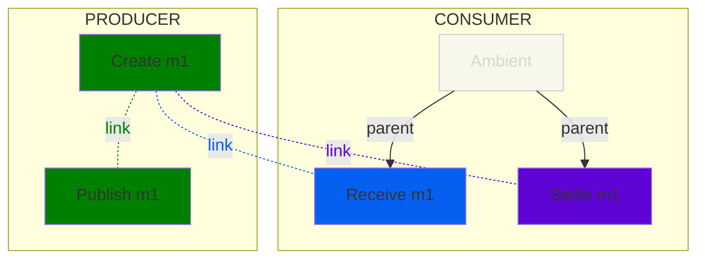
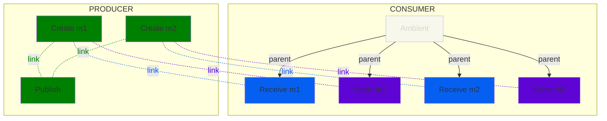
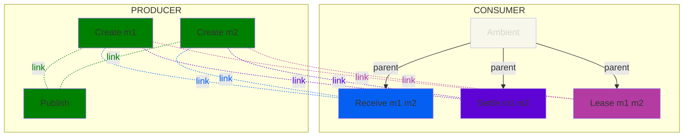

<!--- Hugo front matter used to generate the website version of this page:
linkTitle: Google Cloud Pub/Sub
--->

# Semantic Conventions for Google Cloud Pub/Sub

**Status**: [Experimental][DocumentStatus]

The Semantic Conventions for [Google Cloud Pub/Sub](https://cloud.google.com/pubsub) extend and override the [Messaging Semantic Conventions](README.md) that describe common messaging operations attributes in addition to the Semantic Conventions described on this page.

`messaging.system` MUST be set to `"gcp_pubsub"`.

## Span attributes

For Google Cloud Pub/Sub, the following additional attributes are defined:
<!-- semconv messaging.gcp_pubsub(full,tag=tech-specific-gcp-pubsub) -->
| Attribute  | Type | Description  | Examples  | Requirement Level |
|---|---|---|---|---|
| [`messaging.gcp_pubsub.message.ordering_key`](../attributes-registry/messaging.md) | string | The ordering key for a given message. If the attribute is not present, the message does not have an ordering key. | `ordering_key` | Conditionally Required: If the message type has an ordering key set. |
<!-- endsemconv -->

## stream

[DocumentStatus]: https://github.com/open-telemetry/opentelemetry-specification/tree/v1.26.0/specification/document-status.md
