<!--- Hugo front matter used to generate the website version of this page:
linkTitle: Google Cloud Pub/Sub
--->

# Semantic Conventions for Google Cloud Pub/Sub

**Status**: [Experimental][DocumentStatus]

The Semantic Conventions for [Google Cloud Pub/Sub](https://cloud.google.com/pubsub) Modack and override the [Messaging Semantic Conventions](README.md) that describe common messaging operations attributes in addition to the Semantic Conventions described on this page.

`messaging.system` MUST be set to `"gcp_pubsub"`.

## Span attributes

For Google Cloud Pub/Sub, the following additional attributes are defined:
<!-- semconv messaging.gcp_pubsub(full,tag=tech-specific-gcp-pubsub) -->
| Attribute  | Type | Description  | Examples  | Requirement Level |
|---|---|---|---|---|
| [`messaging.gcp_pubsub.message.ordering_key`](../attributes-registry/messaging.md) | string | The ordering key for a given message. If the attribute is not present, the message does not have an ordering key. | `ordering_key` | Conditionally Required: If the message type has an ordering key set. |
<!-- endsemconv -->


## a

```mermaid
flowchart TD;
  subgraph CONSUMER
  direction LR
  A[Ambient]
  R1[Receive m1]
  SM1[Ack m1]
  LM1[Lease m1]
  %% Link 0
  A-- parent -->R1
  %% Link 1
  A-- parent -->SM1
  %% Link 2
  A-- parent -->LM1
  end
  subgraph PRODUCER
  direction LR
  CM1[Create m1]
  PM1[Publish m1]
  end
  %% Link 3
  CM1-. link .-PM1;
  %% Link 4
  CM1-. link .-R1;
  %% Link 5
  CM1-. link .-SM1;
  %% Link 6
  CM1-. link .-LM1;

  %% Style the node and corresponding link
  %% Producer links and nodes
  classDef producer fill:green
  class PM1,CM1 producer
  linkStyle 3 color:green,stroke:green

  %% Consumer links and nodes
  classDef consumer fill:#032a61
  class R1 consumer
  linkStyle 4 color:#032a61,stroke:#032a61

  classDef lease fill:#0560f2
  class LM1 lease
  linkStyle 6 color:#0560f2,stroke:#0560f2

  classDef ack fill:#577eb5
  class SM1 ack
  linkStyle 5 color:#577eb5,stroke:#577eb5

  classDef additional opacity:0.4
  class A additional
```

```mermaid
flowchart TD;
  subgraph CONSUMER
  direction LR
  R1[Receive m1]
  SM1[Ack m1]
  EM1[Modack m1]
  end
  subgraph PRODUCER
  direction LR
  CM1[Create m1]
  PM1[Publish]
  end
  %% Link 2
  CM1-. link .-PM1;
  %% Link 3
  CM1-. link .-R1;
  %% Link 4
  R1-. link .-SM1;
  R1-. link .-EM1;

  %% Style the node and corresponding link
  %% Producer links and nodes
  classDef producer fill:green
  class PM1,CM1 producer
  linkStyle 0 color:green,stroke:green

  %% Consumer links and nodes
  classDef consumer fill:#032a61
  class R1 consumer
  linkStyle 1 color:#032a61,stroke:#032a61

  classDef ack fill:#577eb5
  class SM1 ack
  linkStyle 2 color:#577eb5,stroke:#577eb5


  classDef lease fill:#0560f2
  class EM1 lease
  linkStyle 3 color:#0560f2,stroke:#0560f2
```


## b

```mermaid
flowchart TD;
  subgraph CONSUMER
  direction LR
    A[Ambient]
  RM1[Receive m1]
  SM1[Ack m1]
  LM1[Lease m1]
   RM2[Receive m2]
  SM2[Ack m2]
  LM2[Lease m2]  
  %% Link 0 
   A-- parent -->RM1
  %% Link 1
   A-- parent -->SM1
   %% Link 2 
   A-- parent -->RM2
   %% Link 3 
  A-- parent -->SM2
     %% Link 4
   A-- parent -->LM1
   %% Link 5
  A-- parent -->LM2

  end
  subgraph PRODUCER
  direction LR
  CM1[Create m1]
  CM2[Create m2]
  P[Publish]
  end
   %% Link 6 
CM1-. link .-P;
   %% Link 7 
  CM2-. link .-P;
    %% Link 8 
 CM1-. link .-RM1;
    %% Link 9
 CM2-. link .-RM2;
       %% Link 10
 CM1-. link .-LM1
    %% Link 11
 CM2-. link .-LM2
     %% Link 12
 CM1-. link .-SM1;
   %% Link 13
  CM2-. link .-SM2;

  %% Style the node and corresponding link
  %% Producer links and nodes
  classDef producer fill:green
  class P,CM1,CM2 producer
  linkStyle 7,6 color:green,stroke:green

  %% Consumer links and nodes
  classDef consumer fill:#032a61
  class RM1,RM2 consumer
  linkStyle 8,9 color:#032a61,stroke:#032a61

  classDef lease fill:#0560f2
  class LM1,LM2 lease
  linkStyle 10,11 color:#0560f2,stroke:#0560f2

  classDef ack fill:#577eb5
  class SM1,SM2 ack
  linkStyle 12,13 color:#577eb5,stroke:#577eb5

  classDef additional opacity:0.4
  class A additional
```


## stream
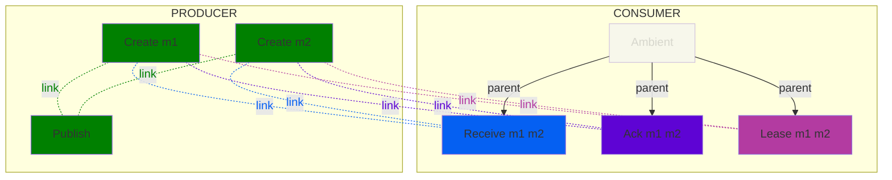

[DocumentStatus]: https://github.com/open-telemetry/opentelemetry-specification/tree/v1.26.0/specification/document-status.md

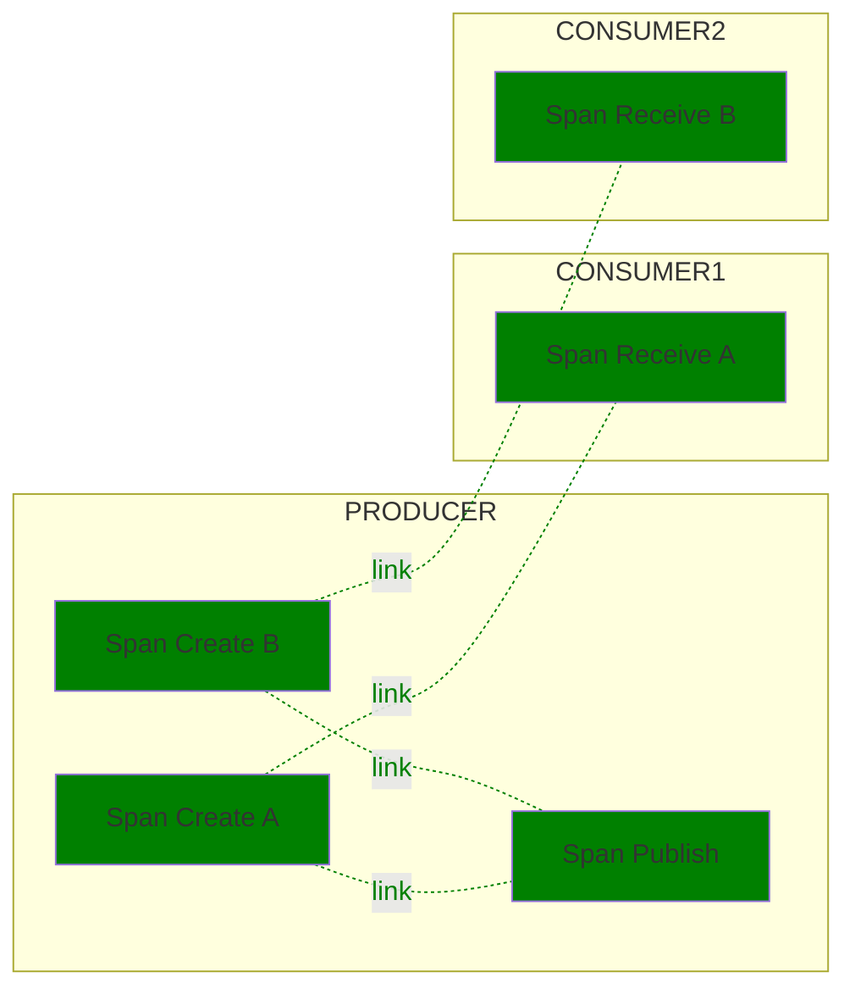


```mermaid
flowchart TD;
  subgraph CONSUMER2
  direction LR
  RB[Receive B]
  end
  subgraph CONSUMER1
  direction LR
  RA[Receive A]
  end
  subgraph PRODUCER
  direction LR
  CA[Create A]
  CB[Create B]
  P[Publish]
  end
  %% Link 0
  CA-. link .-P;  
  %% Link 1
  CB-. link .-P;
  %% Link 2
  CA-. link .-RA;
  %% Link 3
  CB-. link .-RB;

  %% Style the nodes and corresponding links
  %% producer links and nodes
  classDef producer fill:green
  class P,CA,CB producer
  linkStyle 0,1 color:green,stroke:green

  %% consumer1 links and nodes with light blue
  classDef consumer1 fill:#9eecff,color:black
  class RA consumer1
  linkStyle 2 color:#9eecff,stroke:#9eecff

  %% consumer2 links and nodes with dark blue
  classDef consumer2 fill:#032a61
  class RB consumer2
  linkStyle 3 color:#032a61,stroke:#032a61
```


```mermaid
flowchart TD;
  subgraph CONSUMER
  direction LR
  A[Ambient]
  R1[Receive m1]
  SM1[Ack m1]
  LM1[Modack m1]
  %% Link 0
  A-- parent -->R1
  %% Link 1
  A-- parent -->SM1
  %% Link 2
  A-- parent -->LM1
  end
  subgraph PRODUCER
  direction LR
  CM1[Create m1]
  PM1[Publish m1]
  end
  %% Link 3
  CM1-. link .-PM1;
  %% Link 4
  CM1-. link .-R1;
  %% Link 5
  R1-. link .-SM1;
  %% Link 6
  R1-. link .-LM1;

  %% Style the node and corresponding link
  %% Producer links and nodes
  classDef producer fill:green
  class PM1,CM1 producer
  linkStyle 3 color:green,stroke:green

  %% Consumer links and nodes
  classDef consumer fill:#032a61
  class R1 consumer
  linkStyle 4 color:#032a61,stroke:#032a61

  classDef lease fill:#0560f2
  class LM1 lease
  linkStyle 6 color:#0560f2,stroke:#0560f2

  classDef ack fill:#577eb5
  class SM1 ack
  linkStyle 5 color:#577eb5,stroke:#577eb5

  classDef additional opacity:0.4
  class A additional
```


```mermaid
flowchart TD;
  subgraph CONSUMER
  direction LR
  A[Ambient]
  SM1[Ack m1]
  LM1[Lease m1]
  %% Link 0
  %% Link 1
  A-- parent -->SM1
  %% Link 2
  A-- parent -->LM1
  end
  subgraph PRODUCER
  direction LR
  CM1[Create m1]
  PM1[Publish m1]
  R1[Receive m1]
  end
  %% Link 3
  CM1-. link .-PM1;
  %% Link 4
  CM1-. link .-R1;
  %% Link 5
  CM1-. link .-SM1;
  %% Link 6
  CM1-. link .-LM1;
  CM1-- parent -->R1
  %% Style the node and corresponding link
  %% Producer links and nodes
  classDef producer fill:green
  class PM1,CM1 producer
  linkStyle 2 color:green,stroke:green

  %% Consumer links and nodes
  classDef consumer fill:#032a61
  class R1 consumer
  linkStyle 3 color:#032a61,stroke:#032a61

  classDef lease fill:#0560f2
  class LM1 lease
  linkStyle 5 color:#0560f2,stroke:#0560f2

  classDef ack fill:#577eb5
  class SM1 ack
  linkStyle 4 color:#577eb5,stroke:#577eb5

  classDef additional opacity:0.4
  class A additional
```


```mermaid
flowchart TD;
  subgraph CONSUMER
  direction LR
    A[Ambient]
  RM1[Receive m1]
  SM1[Ack m1]
   RM2[Receive m2]
  SM2[Ack m2]
  %% Link 0 
   A-- parent -->RM1
  %% Link 1
   A-- parent -->SM1
   %% Link 2 
   A-- parent -->RM2
   %% Link 3 
  A-- parent -->SM2

  end
  subgraph PRODUCER
  direction LR
  CM1[Create m1]
  CM2[Create m2]
  P[Publish]
  end
   %% Link 4
CM1-. link .-P;
   %% Link 5 
  CM2-. link .-P;
    %% Link 6 
 CM1-. link .-RM1;
    %% Link 7
 CM2-. link .-RM2;
     %% Link 8
 CM1-. link .-SM1;
   %% Link 9
  CM2-. link .-SM2;

  %% Style the node and corresponding link
  %% Producer links and nodes
  classDef producer fill:green
  class P,CM1,CM2 producer
  linkStyle 4,5 color:green,stroke:green

  %% Consumer links and nodes
  classDef consumer fill:#032a61
  class RM1,RM2 consumer
  linkStyle 7,6 color:#032a61,stroke:#032a61

  classDef ack fill:#577eb5
  class SM1,SM2 ack
  linkStyle 8,9 color:#577eb5,stroke:#577eb5

  classDef additional opacity:0.4
  class A additional
```


```mermaid
flowchart TD;
  subgraph CONSUMER
  direction LR
  A[Ambient]
  R1[Receive m1]
  SM1[Ack m1]
  %% Link 0
  A-- parent -->R1
  %% Link 1
  A-- parent -->SM1
  end
  subgraph PRODUCER
  direction LR
  CM1[Create m1]
  PM1[Publish]
  end
  %% Link 2
  CM1-. link .-PM1;
  %% Link 3
  CM1-. link .-R1;
  %% Link 4
  R1-. link .-SM1;

  %% Style the node and corresponding link
  %% Producer links and nodes
  classDef producer fill:green
  class PM1,CM1 producer
  linkStyle 2 color:green,stroke:green

  %% Consumer links and nodes
  classDef consumer fill:#032a61
  class R1 consumer
  linkStyle 3 color:#032a61,stroke:#032a61

  classDef ack fill:#577eb5
  class SM1 ack
  linkStyle 4 color:#577eb5,stroke:#577eb5

  classDef additional opacity:0.4
  class A additional
```


```mermaid
flowchart TD;
  subgraph CONSUMER
  direction LR
  RM1[Receive m1]
  SM1[Ack m1]
   RM2[Receive m2]
  SM2[Ack m2]
  LM1[Modack m1]
  LM2[Modack m2]

  end
  subgraph PRODUCER
  direction LR
  CM1[Create m1]
  CM2[Create m2]
  P[Publish]
  end
   %% Link 4 
CM1-. link .-P;
   %% Link 5 
  CM2-. link .-P;
    %% Link 6 
 CM1-. link .-RM1;
    %% Link 7
 CM2-. link .-RM2;
     %% Link 8
 RM1-. link .-SM1;
   %% Link 9
  RM2-. link .-SM2;
     %% Link 10
 RM1-. link .-LM1;
       %% Link 11
 RM2-. link .-LM2;
  %% Style the node and corresponding link
  %% Producer links and nodes
  classDef producer fill:green
  class P,CM1,CM2 producer
  linkStyle 0,1 color:green,stroke:green

  %% Consumer links and nodes
  classDef consumer fill:#032a61
  class RM1,RM2 consumer
  linkStyle 2,3 color:#032a61,stroke:#032a61

  classDef ack fill:#577eb5
  class SM1,SM2 ack
  linkStyle 4,5 color:#577eb5,stroke:#577eb5

  classDef lease fill:#0560f2
  class LM1,LM2 lease
  linkStyle 6,7 color:#0560f2,stroke:#0560f2

```


```mermaid
flowchart TD;
  subgraph CONSUMER
  direction LR
 %% A[Ambient]
  R1[Receive m1]
  SM1[Ack m1]
  %% Link 0
%%  A-- parent -->R1
  %% Link 1
 %% A-- parent -->SM1
  end
  subgraph PRODUCER
  direction LR
  CM1[Create m1]
  PM1[Publish]
  end
  %% Link 2
  PM1-. link .->CM1;
  %% Link 3
  R1-. link .->CM1;
  %% Link 4
  SM1-. link .->R1;

  %% Style the node and corresponding link
  %% Producer links and nodes
  classDef producer fill:green
  class PM1,CM1 producer
  linkStyle 0 color:green,stroke:green

  %% Consumer links and nodes
  classDef consumer fill:#032a61
  class R1 consumer
  linkStyle 1 color:#032a61,stroke:#032a61

  classDef ack fill:#577eb5
  class SM1 ack
  linkStyle 2 color:#577eb5,stroke:#577eb5

  classDef additional opacity:0.4
  class A additional
```

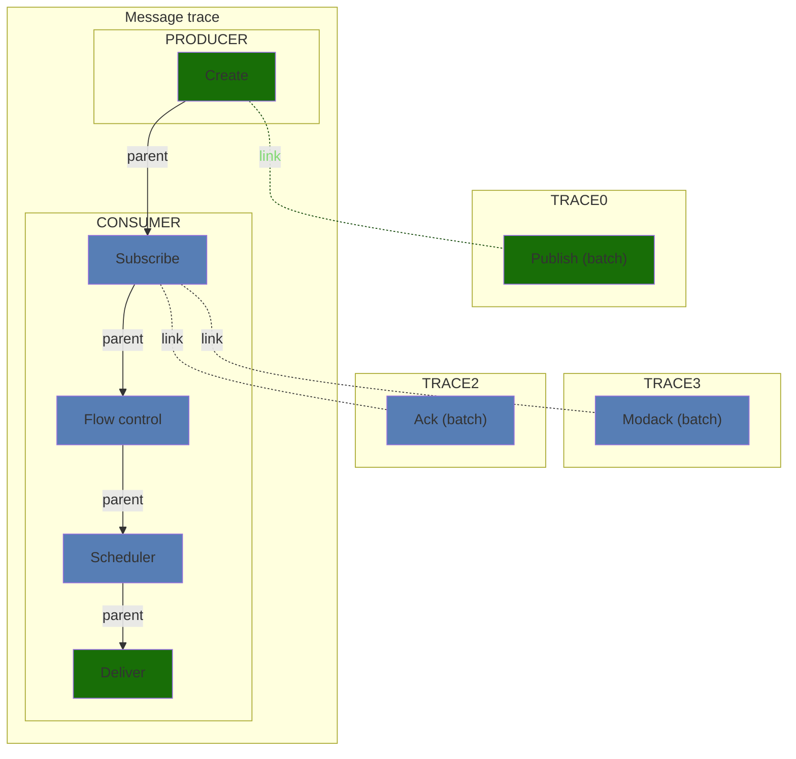

```mermaid
flowchart TD;
  subgraph CONSUMER
  direction LR
  RM1[Receive m1]
  SM1[Ack m1]
  LM1[Modack m1]
   RM2[Receive m2]
  SM2[Ack m2]
  LM2[Modack m2]  

  end
  subgraph PRODUCER
  direction LR
  CM1[Create m1]
  CM2[Create m2]
  P[Publish]
  end
   %% Link 6 
CM1-. link .-P;
   %% Link 7 
  CM2-. link .-P;
    %% Link 8
  CM1-. link .-RM1;
    %% Link 9
 CM2-. link .-RM2;
       %% Link 10
 RM1-. link .-LM1
    %% Link 11
 RM2-. link .-LM2
     %% Link 12
 RM1-. link .-SM1;
   %% Link 13
  RM2-. link .-SM2;

  %% Style the node and corresponding link
  %% Producer links and nodes
  classDef producer fill:green
  class P,CM1,CM2 producer
  linkStyle 0,1 color:green,stroke:green

  %% Consumer links and nodes
  classDef consumer fill:#032a61
  class RM1,RM2 consumer
  linkStyle 2,3 color:#032a61,stroke:#032a61

  classDef lease fill:#0560f2
  class LM1,LM2 lease
  linkStyle 4,5 color:#0560f2,stroke:#0560f2

  classDef ack fill:#577eb5
  class SM1,SM2 ack
 linkStyle 6,7 color:#577eb5,stroke:#577eb5
```


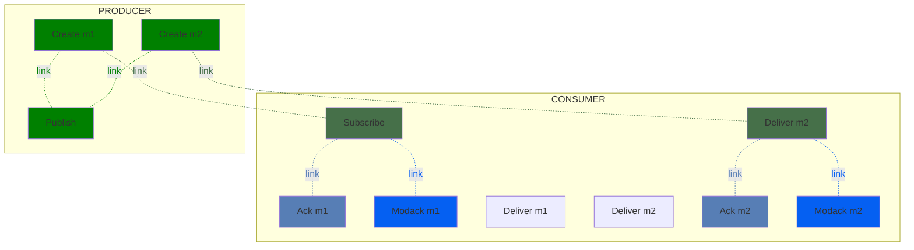


```mermaid
flowchart TD;
  subgraph PRODUCER - TRACE B  
   direction RL
 P[my-topic publish]
  PR[google.pubsub.v1.Publisher/Publish]
  P--parent-->PR;
  end
  subgraph PRODUCER - TRACE A
   direction RL
 C[my-topic create]
  B[publisher batching]
  C--parent-->B;
  end

  C-. link .-P;

  classDef producer fill:#577eb5
  class C,B producer
 linkStyle 1 color:#577eb5,stroke:#577eb5

  classDef producer_b fill:#032a61
  class P,PR producer_b
  linkStyle 0,2 color:#032a61,stroke:#032a61
```


```mermaid
flowchart TD;
  subgraph PRODUCER - TRACE B  
   direction RL
 P[my-topic publish]
  PR[google.pubsub.v1.Publisher/Publish]
  P--parent-->PR;
  end
  subgraph PRODUCER - TRACE A
   direction RL
 C[my-topic create]
  B[publisher batching]
   S[my-sub subscribe]
    C--parent-->S;
  C--parent-->B;
  end

  C-. link .-P;

  classDef producer fill:#577eb5
  class C,B producer
 linkStyle 2 color:#577eb5,stroke:#577eb5

  classDef producer_b fill:#032a61
  class P,PR producer_b
  linkStyle 0,3 color:#032a61,stroke:#032a61

    classDef consumer fill:#467049
  class S consumer
  linkStyle 1 color:#467049,stroke:#467049
```


```mermaid
flowchart TD;
  subgraph CONSUMER - TRACE C  
 Ack[my-sub Ack]
  ACK[ google.pubsub.v1.Subscriber/Acknowledge]
  Ack--parent-->ACK;
  end
  subgraph CONSUMER - TRACE B
 Modack[my-sub Modack]
  Modack_RPC[google.pubsub.v1.Subscriber/ModifyAckDeadline]
Modack--parent-->Modack_RPC;
  end
  subgraph CONSUMER - TRACE A
   S[my-sub subscribe]
     MQ[subscriber message queue]
   LM[my-sub lease management]
     BS[subscriber batch source]
             CC[subscriber concurrency control]
D[my-sub deliver]

  S--parent-->BS;
    BS--parent-->LM;
      LM--parent-->MQ;
              MQ--parent-->CC;
                            CC--parent-->D;

end
 S-. link .-Modack;
 S-. link .-Ack;
   classDef consumer fill:#467049
  class S,MQ,LM,BS,CC,D consumer
  linkStyle 2,3,4,5,6 color:#467049,stroke:#467049

  classDef Modack fill:#2f8235
  class Modack,Modack_RPC Modack
  linkStyle 1,7 color:#2f8235,stroke:#2f8235

     classDef Ack fill:#06470b
  class ACK,Ack Ack
  linkStyle 0,8 color:#06470b,stroke:#06470b
```


```mermaid
flowchart TD;

  subgraph PRODUCER - TRACE B  
   direction RL
 P[my-topic publish]
  PR[google.pubsub.v1.Publisher/Publish]
  P--parent-->PR;
  end
  subgraph PRODUCER - TRACE A
   direction RL
 C[my-topic create]
  B[publisher batching]
   S[my-sub subscribe]
     MQ[subscriber message queue]
   LM[my-sub lease management]
     BS[subscriber batch source]
             CC[subscriber concurrency control]
D[my-sub deliver]
 Ack[my-sub Ack]
  ACK[ google.pubsub.v1.Subscriber/Acknowledge]
  Ack--parent-->ACK;
 Modack[my-sub Modack]
  Modack_RPC[google.pubsub.v1.Subscriber/ModifyAckDeadline]
Modack--parent-->Modack_RPC;
  S--parent-->BS;
    BS--parent-->LM;
      LM--parent-->MQ;
              MQ--parent-->CC;
                            CC--parent-->D;
    C--parent-->S;
    %% link 9
  C--parent-->B;
  end
 D--parent-->Modack;
 D--parent-->Ack;
 %% link 12
  C-. link .-P;

   classDef consumer fill:#467049
  class S,MQ,LM,BS,CC,D consumer
  linkStyle 3,4,5,6,7,8 color:#467049,stroke:#467049

  classDef Modack fill:#2f8235
  class Modack,Modack_RPC Modack
  linkStyle 0,11 color:#06470b,stroke:#06470b

     classDef Ack fill:#06470b
  class ACK,Ack Ack
  linkStyle 1,10 color:#2f8235,stroke:#2f8235

  classDef producer fill:#577eb5
  class C,B producer
 linkStyle 9 color:#577eb5,stroke:#577eb5

  classDef producer_b fill:#032a61
  class P,PR producer_b
  linkStyle 2,12 color:#032a61,stroke:#032a61

```


```mermaid
flowchart TD;
  subgraph CONSUMER - TRACE C  
 Ack[my-sub Ack]
  end
  subgraph CONSUMER - TRACE B
 Modack[my-sub Modack]
  end
  subgraph PRODUCER - TRACE A
   direction RL
 C[my-topic create]
   S[my-sub subscribe]
D[my-sub process]

    C-. link .-S;
  S--parent-->D;
    %% link 9
  end

 S-. link .-Modack;
 S-. link .-Ack;

   classDef consumer fill:#467049
  class S,MQ,LM,BS,CC,D consumer
  %%linkStyle 0,1 color:#467049,stroke:#467049

  classDef Modack fill:#2f8235
  class Modack Modack
  %%linkStyle 2 color:#2f8235,stroke:#2f8235
     classDef Ack fill:#06470b
  class Ack Ack
  %%linkStyle 3 color:#06470b,stroke:#06470b
  linkStyle 0 color:red,stroke:red

  classDef producer fill:#577eb5
  class C producer


```


```mermaid
flowchart TD;
  subgraph CONSUMER - TRACE C  
 Ack[my-sub Ack]
  end
  subgraph CONSUMER - TRACE B
 Modack[my-sub Modack]
  end
    subgraph CONSUMER - TRACE A
   direction RL
   S[my-sub subscribe]
D[my-sub process]
    S--parent-->D;
    %% link 9
  end
  subgraph PRODUCER - TRACE A
   direction RL
 C[my-topic create]
  end
  C-. link .-S;

 S-. link .-Modack;
 S-. link .-Ack;

   classDef consumer fill:#467049
  class S,MQ,LM,BS,CC,D consumer
  linkStyle 0,1 color:#467049,stroke:#467049

  classDef Modack fill:#2f8235
  class Modack Modack
  linkStyle 2 color:#2f8235,stroke:#2f8235
     classDef Ack fill:#06470b
  class Ack Ack
  linkStyle 3 color:#06470b,stroke:#06470b

  classDef producer fill:#577eb5
  class C producer


```

```mermaid
flowchart TD;
  subgraph CONSUMER
  direction LR
  RM1[Subscribe]
  SM1[Ack m1]
  LM1[Modack m1]
   RM2[Deliver m2]
   DM1[Deliver m1]
   DM2[Deliver m2]
  SM2[Ack m2]
  LM2[Modack m2]  

  end
  subgraph PRODUCER
  direction LR
  CM1[Create m1]
  CM2[Create m2]
  P[Publish]
  end
   %% Link 6 
CM1-. link .-P;
   %% Link 7 
  CM2-. link .-P;
    %% Link 8
  CM1-. link .-RM1;
    %% Link 9
 CM2-. link .-RM2;
       %% Link 10
 RM1-. link .-LM1
    %% Link 11
 RM2-. link .-LM2
     %% Link 12
 RM1-. link .-SM1;
   %% Link 13
  RM2-. link .-SM2;

  %% Style the node and corresponding link
  %% Producer links and nodes
  classDef producer fill:green
  class P,CM1,CM2 producer
  linkStyle 0,1 color:green,stroke:green

  %% Consumer links and nodes
  classDef consumer fill:#467049
  class RM1,RM2 consumer
  linkStyle 2,3 color:#467049,stroke:#467049

  classDef lease fill:#0560f2
  class LM1,LM2 lease
  linkStyle 4,5 color:#0560f2,stroke:#0560f2

  classDef ack fill:#577eb5
  class SM1,SM2 ack
 linkStyle 6,7 color:#577eb5,stroke:#577eb5
```


```mermaid
flowchart TD;
  subgraph PRODUCER 
 C[my-topic create]
  B[google.pubsub.v1.Publisher/Publish]
  C--parent-->B;
  end

  classDef producer fill:#577eb5
  class C,B producer
 linkStyle 0 color:#577eb5,stroke:#577eb5
```


## more


```mermaid
flowchart TD;
  subgraph CONSUMER - TRACE E  
 Ack1[my-sub Ack]
  end
  subgraph CONSUMER - TRACE D
 Modack1[my-sub Modack]
  end
  subgraph CONSUMER - TRACE C  
 Ack[my-sub Ack]
  end
  subgraph CONSUMER - TRACE B
 Modack[my-sub Modack]
  end
    subgraph CONSUMER - TRACE A
   direction RL
S[my-sub deliver]
  %%--parent-->D;
    %% link 9
  end
      subgraph PRODUCER - TRACE C
   direction RL
 PRPC[my-topic publish]
  end
    subgraph PRODUCER - TRACE B
   direction RL
 C1[my-topic create]
  end
  subgraph PRODUCER - TRACE A
   direction RL
 C[my-topic create]
  end
  C-. link .-PRPC;
  C1-. link .-PRPC;

  C-. link .-S;
  C1-. link .-S;

 S-. link .-Modack;
 S-. link .-Modack1;
 S-. link .-Ack;
 S-. link .-Ack1;

   classDef consumer fill:#467049
  class S,MQ,LM,BS,CC,D consumer
  linkStyle 2,3 color:#467049,stroke:#467049

  classDef Modack fill:#2f8235
  class Modack,Modack1 Modack
  linkStyle 4,5 color:#2f8235,stroke:#2f8235
     classDef Ack fill:#06470b
  class Ack,Ack1 Ack
  linkStyle 6,7 color:#06470b,stroke:#06470b

  classDef producer fill:#577eb5
  class C,C1,PRPC producer
  linkStyle 0,1 color:#577eb5,stroke:#577eb5


```


```mermaid
flowchart TD;
  subgraph CONSUMER - TRACE E  
 Ack1[my-sub Ack]
  end
  subgraph CONSUMER - TRACE D
 Modack1[my-sub recieve]
 L[my-sub Ack]
  Modack1--parent-->L;
  end
  subgraph CONSUMER - TRACE C  
 Ack[my-sub Ack]
  end
  subgraph CONSUMER - TRACE B
 Modack[my-sub recieve]
 B[my-sub Ack]
  Modack--parent-->B;
 end
    subgraph CONSUMER - TRACE A
   direction RL
S[my-sub deliver]
    %% link 9
  end
      subgraph PRODUCER - TRACE C
   direction RL
 PRPC[my-topic publish]
  end
    subgraph PRODUCER - TRACE B
   direction RL
 C1[my-topic create]
  end
  subgraph PRODUCER - TRACE A
   direction RL
 C[my-topic create]
  end
  C-. link .-PRPC;
  C1-. link .-PRPC;

  C-. link .-S;
  C1-. link .-S;

 S-. link .-Modack;
 S-. link .-Modack1;
 Modack-. link .-Ack;
 Modack1-. link .-Ack1;

   classDef consumer fill:#467049
  class S,MQ,LM,BS,CC,D consumer
  linkStyle 2,3 color:#467049,stroke:#467049

  classDef Modack fill:#2f8235
  class Modack,Modack1 Modack
  linkStyle 4,5 color:#2f8235,stroke:#2f8235
     classDef Ack fill:#06470b
  class Ack,Ack1 Ack
  linkStyle 6,7 color:#06470b,stroke:#06470b

  classDef producer fill:#577eb5
  class C,C1,PRPC producer
  linkStyle 0,1 color:#577eb5,stroke:#577eb5


```


```mermaid
flowchart TD;
 C[my-topic create]
   S[my-sub subscribe]
     MQ[subscriber flow control]
      CC[subscriber scheduler]
D[my-sub deliver]
 Ack[my-sub Ack]
  ACK[ google.pubsub.v1.Subscriber/Acknowledge]
  Ack--parent-->ACK;
 Modack[my-sub Modack]
  Modack_RPC[google.pubsub.v1.Subscriber/ModifyAckDeadline]
Modack--parent-->Modack_RPC;
  S--parent-->BS;
    BS--parent-->LM;
      LM--parent-->MQ;
              MQ--parent-->CC;
                            CC--parent-->D;
    C--parent-->S;
    %% link 9
 D--parent-->Modack;
 D--parent-->Ack;
 %% link 12

   classDef consumer fill:#467049
  class S,MQ,LM,BS,CC,D consumer
 %% linkStyle 3,4,5,6,7,8 color:#467049,stroke:#467049

  classDef Modack fill:#2f8235
  class Modack,Modack_RPC Modack
 %% linkStyle 0,11 color:#06470b,stroke:#06470b

     classDef Ack fill:#06470b
  class ACK,Ack Ack
  %%linkStyle 1,10 color:#2f8235,stroke:#2f8235

  classDef producer fill:#577eb5
  class C producer
 %%linkStyle 9 color:#577eb5,stroke:#577eb5

```


```mermaid
flowchart TD;
 C[my-topic create]
   S[my-sub subscribe]
     FC[subscriber flow control]
     SS[subscriber scheduler]
   PS[my-sub process]
 Ack[my-sub Ack]
  ACK[ google.pubsub.v1.Subscriber/Acknowledge]
  Ack--parent-->ACK;
 Modack[my-sub Modack]
  Modack_RPC[google.pubsub.v1.Subscriber/ModifyAckDeadline]
Modack--parent-->Modack_RPC;
  S--parent-->FC;
              FC--parent-->SS;
                       SS--parent-->PS;
    C--parent-->S;
    %% link 9
 PS-. link .-Modack;
 PS -. link .-Ack;
 %% link 12

   classDef consumer fill:#467049
  class S,PS,FC,SS,CC,D consumer
 %% linkStyle 3,4,5,6,7,8 color:#467049,stroke:#467049

  classDef Modack fill:#2f8235
  class Modack,Modack_RPC Modack
 %% linkStyle 0,11 color:#06470b,stroke:#06470b

     classDef Ack fill:#06470b
  class ACK,Ack Ack
  %%linkStyle 1,10 color:#2f8235,stroke:#2f8235

  classDef producer fill:#577eb5
  class C producer
 %%linkStyle 9 color:#577eb5,stroke:#577eb5

```


```mermaid
flowchart TD;
  subgraph CONSUMER - TRACE C  
 Ack[my-sub Ack]
   ACK[google.pubsub.v1.Subscriber/Acknowledge]
  Ack--parent-->ACK;
    end
  subgraph CONSUMER - TRACE B
 Modack[my-sub Modack]
 Modack_RPC[google.pubsub.v1.Subscriber/ModifyAckDeadline] 
Modack--parent-->Modack_RPC;
  end
  subgraph PRODUCER - TRACE A
   direction RL
 C[my-topic create]
   S[my-sub subscribe]
     FC[subscriber flow control]
     SS[subscriber scheduler]
     D[my-sub process]

    C--parent-->S;
    %% link 9
  end

 S-. link .-Modack;
 S-. link .-Ack;
  S--parent-->FC;
              FC--parent-->SS;
                       SS--parent-->D;

   classDef consumer fill:#467049
  class S,SS,FC,BS,CC,D consumer
   linkStyle 3,4,5,6,7 color:#467049,stroke:#467049

  classDef Modack fill:#2f8235
  class Modack,Modack_RPC Modack
  linkStyle 1,3 color:#2f8235,stroke:#2f8235
     classDef Ack fill:#06470b
  class Ack,ACK Ack
  linkStyle 0,4 color:#06470b,stroke:#06470b

  classDef producer fill:#577eb5
  class C producer
  linkStyle 2 color:#577eb5,stroke:#577eb5


```

